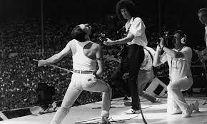
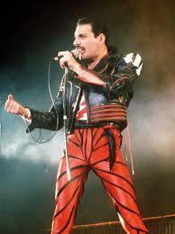

# Queen: Legendary Music, Epic Performances!
 
 
Queen is a British rock band formed in London in 1971. They are known for their classic rock sound and flamboyant live performances with frontman Freddie Mercury. Queen is one of the best-selling bands of all time, with over 300 million records sold worldwide. They have released 15 studio albums, 18 compilation albums, and 68 singles. Their most iconic songs include "Bohemian Rhapsody", "We Will Rock You", "Another One Bites The Dust", "We Are The Champions", and "Killer Queen". Queen was inducted into the Rock and Roll Hall of Fame in 2001 and received the Grammy Lifetime Achievement Award in 2018.

# Unlock the past, discover the music of yesterday. 

 Queen is the best rock band of all time because of their exceptional songwriting, musicianship, and live performances. Queen was able to blend multiple genres of music and create a unique sound that was groundbreaking for the time. They also wrote and performed some of the most iconic and beloved rock songs of all time, such as “Bohemian Rhapsody”, “We Will Rock You”, and “We Are The Champions”. Queen was able to reach a wide audience with their music and performances, and their influence on rock music is still felt today. 
 
# Who are the band members of Queen? 

The band members of Queen are Freddie Mercury (lead vocals, piano), Brian May (guitar, vocals), Roger Taylor (drums, vocals), and John Deacon (bass guitar).

# Flamboyant Fashion & Regal Style. 

The band Queen had a very flamboyant style of clothing. They often wore bright colors, ornate patterns, and colorful accessories. They often wore blazers, patterned shirts, and tight trousers, as well as bow ties, waistcoats, and suspenders. They also often dressed in a regal style, wearing crowns and velvet robes.  

# The Music That Defined a Generation.

The most played song by Queen on YouTube is "Bohemian Rhapsody" with over 1.3 billion views.  

# Capturing Iconic Moments in Music History!

 
 
 
 

<button style="background-color:black; color:white;">Home</button>  
<button style="background-color:black; color:white;">About</button>
